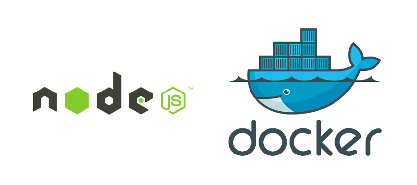

# NodeJS API Template



This is a Node.js Api Skeleton. It uses Express, MongoDB, Redis and Docker.

The docker-compose.prod file includes implementation for docker-swarm.

## Local development

Create a `.env` file in the root of the project with the following contents:

```bash
PORT= "4000"
MONGO_DB_URL= "[YOUR_MONGO_DB_CONNECTION_URL]"
REDIS_URL= "[YOUR_REDIS_DB_CONNECTION_URL]"
REDIS_PORT= "[YOUR_REDIS_PORT]"
SESSION_SECRET= "[JWT_SESSION_SECRET]"
```

1. Clone the repo

   ```sh

   git clone https://github.com/karokojnr/nodejs-api-template.git

   ```

2. Install npm packages

   ```sh

   npm install

   ```

3. To run the app:

   ```sh

   npm start

   ```

## Contributing

Pull requests are welcome. For major changes, please open an issue first to discuss what you would like to change.

## License

[MIT](./LICENSE)
